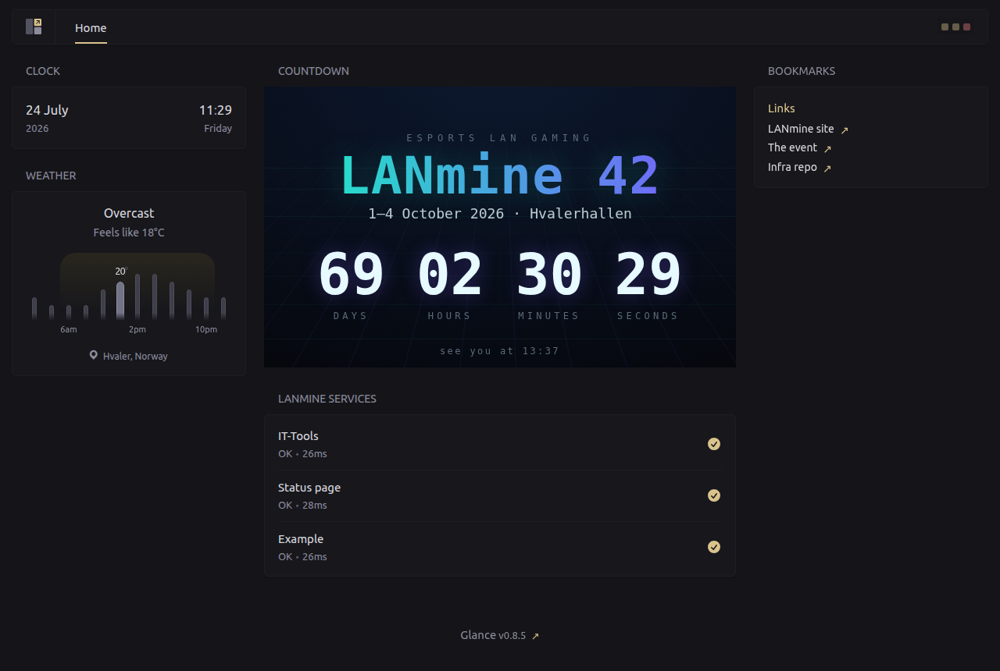
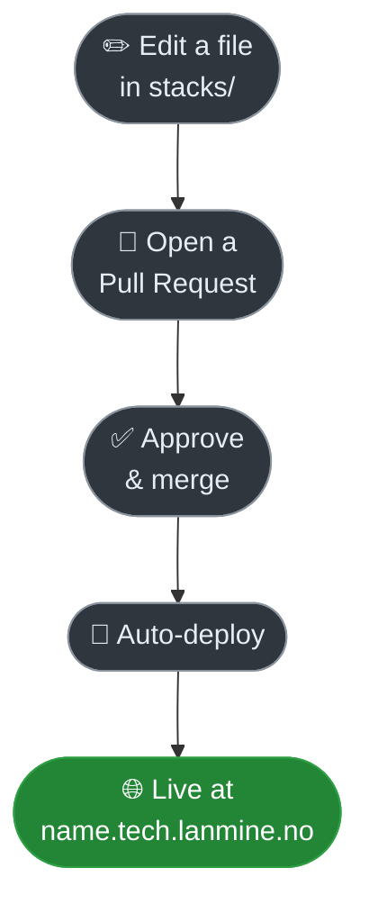

# lanmine_infra

This repo runs our servers. **Change a file here → open a Pull Request → it goes live.**

## Live dashboard → [dash.tech.lanmine.no](https://dash.tech.lanmine.no)

[](https://dash.tech.lanmine.no)

## How it works



## Deploy a service

1. Create the file `stacks/<name>/docker-compose.yml`
2. Paste this and change the **3 marked lines**:

```yaml
services:
  app:
    image: nginx:latest                                              # 1. the program to run
    restart: unless-stopped
    networks: [traefik]
    labels:
      - traefik.enable=true
      - traefik.docker.network=traefik
      - traefik.http.routers.NAME.rule=Host(`NAME.tech.lanmine.no`)  # 2. your web address
      - traefik.http.routers.NAME.service=NAME
      - traefik.http.services.NAME.loadbalancer.server.port=80       # 3. the port your program uses

networks:
  traefik:
    external: true
```

3. Replace every **`NAME`** with your service name.
4. Open a Pull Request. Once it's merged, go to `https://NAME.tech.lanmine.no`.

## Two things to remember

- **Never put a password or key in a file** (this repo is public). Need one? Ask a maintainer.
- **Storing data?** Add a `volumes:` — otherwise it's wiped on the next deploy.

## Copy from these

- `stacks/example/` — the simplest possible service
- `stacks/gatus/` — monitoring; add a check by editing `stacks/gatus/config.yaml`

---
<sub>Maintainers: automation lives in `.github/workflows/` (validate on PR, deploy on merge, nightly redeploy).</sub>
